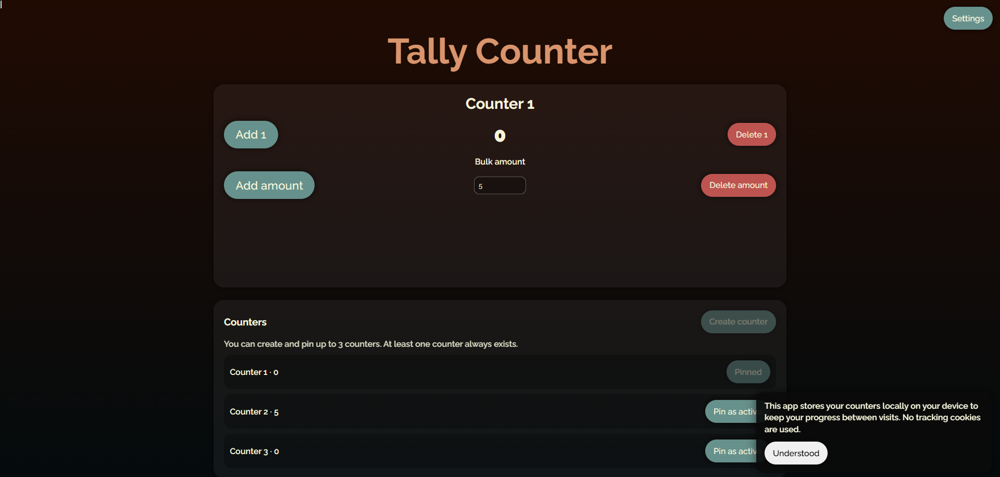
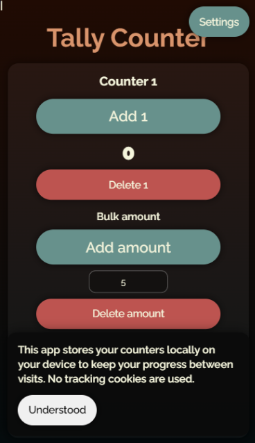

# Tally Counter

A responsive, production-minded Tally Counter web application built with vanilla HTML, CSS, and JavaScript.

## Overview

This project provides an interactive tally counting experience with:
- Multiple counters (up to 3) with active pinning
- Single and bulk tally operations
- Animated tally group creation/removal
- Persistent user state (counters + settings)
- Theme settings (dark/light) and configurable group size
- Structured settings panel with future-ready language section

## Key Features

### Counter Management
- One counter always exists by default
- Create and pin up to 3 counters
- Active counter workspace with real-time updates

### Tally Operations
- Add/Delete by 1
- Add/Delete by custom bulk amount
- Dynamic tally grouping from 2 to 10 marks per group

### Animations
- Lateral group-enter animation (copy-like effect)
- Inverse group-exit animation when complete groups are removed
- Smooth container grow/shrink transition based on content changes

### Settings Panel
- Top-right settings access
- Animated open/close transitions
- Auto-close when clicking outside
- Theme toggle via slider
- Group size slider (2-10)
- Language selector scaffold for next phase

### Persistence & Notice
- Local storage persistence for app state and settings
- Storage notice with acknowledgment and dismiss animation

## Project Structure

```text
.
├── index.html
├── README.md
├── assets/
│   ├── css/
│   │   └── styles.css
│   ├── js/
│   │   └── app.js
│   └── images/
└── docs/
    └── images/
```

## Run Locally

1. Clone the repository.
2. Open the project folder in VS Code.
3. Run `index.html` with Live Server (or open directly in a modern browser).

## Configuration Notes

- **Tallies per group:** configurable from `2` to `10` in Settings.
- **Counters:** hard limited to `3` by application rules.
- **State persistence:** uses browser localStorage.

## Screenshots

Screenshots are stored in `assets/images`:
- `desktopView.png`
- `mobileView.png`

Then they will be rendered here:




## Roadmap

- Complete i18n text switching using the existing language selector
- Add keyboard shortcuts and accessibility refinements
- Add automated tests for state and rendering logic
